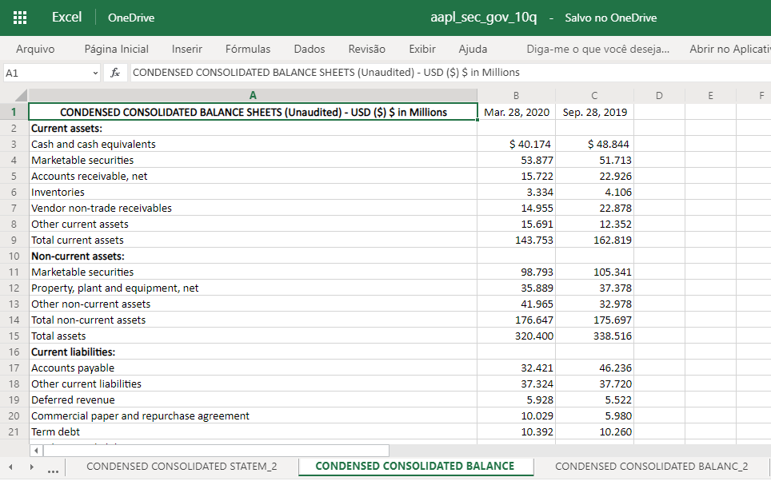
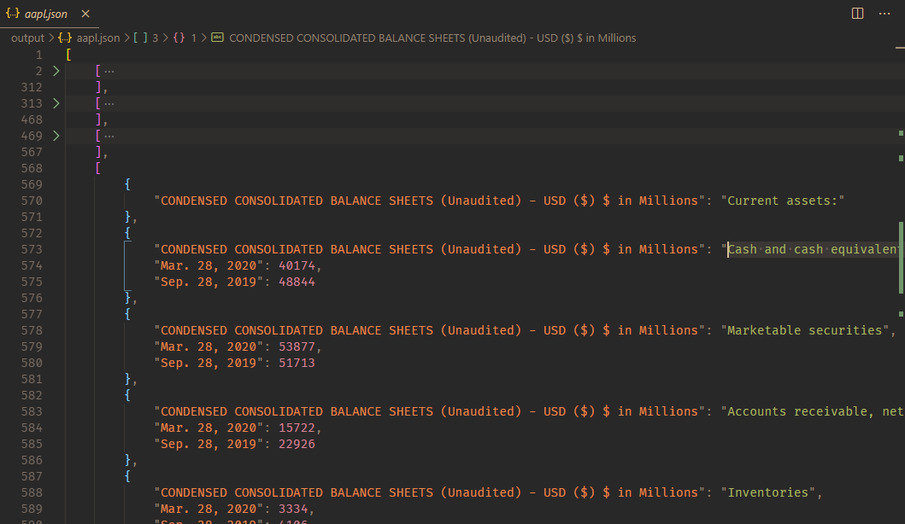
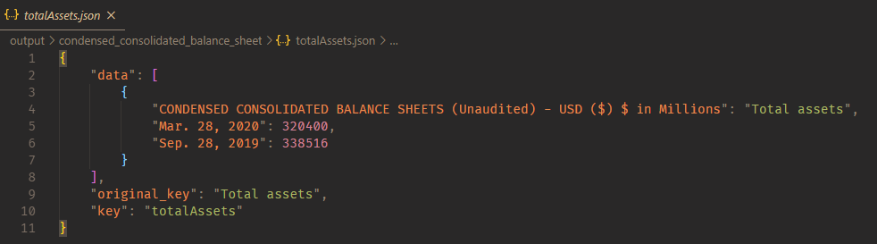

# Intermediate Example

> More complex use case

## How To

Just git clone this repository and use either _'npm install'_, or _'yarn install'_.
Then just hits _'npm start'_ or _'yarn start'_

## What it do

I get this data from [sec_gov - AAPL](https://www.sec.gov/cgi-bin/viewer?action=view&cik=320193&accession_number=0000320193-20-000052&xbrl_type=v). It is the balance from the Apple company.
What we gonna do here is to transform the excel file into a readable .json

## Media

**From this Excel**:

**To this .json file**:

**Then we gonna split, taking only the data from CONDENSED CONSOLIDATED BALANCE SHEETS (Unaudited)**:

